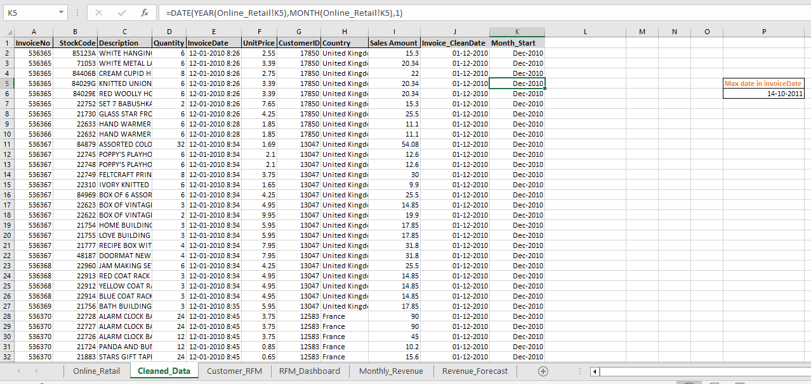

# Customer Segmentation & RFM Analysis

## Project Overview

This project applies RFM (Recency, Frequency, Monetary) Analysis on an online retail dataset to segment customers into meaningful business groups and generate actionable marketing insights.

The project was developed entirely in Microsoft Excel using:

- Data Cleaning
- Customer Segmentation
- Pivot Tables
- Revenue Trend Analysis
- Revenue Forecasting
- Interactive Dashboard Design

---

## Dataset

Online Retail Dataset

Period:
December 2010 – December 2011

---

## Business Objectives

- Identify high-value customers
- Detect customers at risk of churn
- Analyze purchasing behavior
- Forecast future revenue trends
- Support data-driven marketing decisions

---

## Customer Segments

| Segment | Description |
|----------|-------------|
| Champion | Highest spending and most engaged customers |
| VIP | High-value loyal customers |
| Loyal | Frequent repeat customers |
| Regular | Average customers with moderate engagement |
| At Risk | Customers with declining activity |

---

## Dashboard Features

- Total Customers KPI
- At Risk Customers KPI
- Champion Customers KPI
- Customer Distribution Analysis
- Average Customer Value Analysis
- Segment-wise Revenue Analysis
- Business Recommendations

## Dashboard Screenshots

### RFM Dashboard

### Revenue Trend Analysis

### Revenue Forecast

### Data Cleaning sheet Sample screenshot

---

## Revenue Forecasting

Forecasted next 3 months revenue using Excel Forecast Sheet and ETS forecasting methods.

---

## Key Insights

- Loyal customers represent the largest customer group.
- Champions generate significantly higher average revenue per customer.
- At Risk customers require re-engagement campaigns.
- Revenue shows seasonal fluctuations with peaks during certain months.

---

## Tools Used

- Microsoft Excel
- Pivot Tables
- Pivot Charts
- RFM Analysis
- Forecast Sheet
- Conditional Formatting

---

## Project Files

| File | Description |
|--------|------------|
| Customer Segmentation & RFM Analysis.xlsx | Complete Excel Workbook |
| Customer Segmentation & RFM Analysis Report.docx | Detailed Project Report |
| Screenshots | Dashboard and Analysis Images |

---

## Author

Sri Pavani
